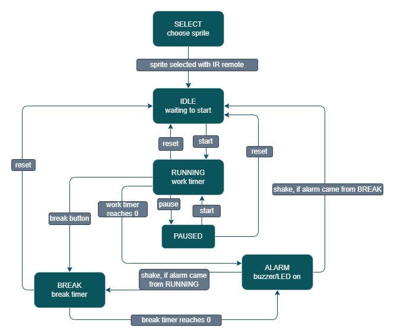

[comment]: # (this is a hidden comment)

[//]: # just testing this # means header 1, #### means header 4

# Overview

Desk Buddy is a standalone embedded device designed to help students stay focused while studying by following a Pomodoro-style work and break cycle. The goal of the project was to build a small desk companion that helps users manage their focus time without needing to rely on a phone or computer. The device uses an OLED display to show the countdown timer and the current system mode, such as `SELECT`, `IDLE`, `RUN`, `BREAK`, `PAUSE`, and `ALARM`. The user interacts with the system using an IR remote, which allows them to choose a sprite, start a work session, pause the timer, reset the system, or switch to break mode without needing to use a terminal or connect to a computer.

## Goals
- Implement Pomodoro Timer
- Detect shakes
- Dictionary Search

## Design

### Functional Specification

The behavior of Desk Buddy is controlled using a finite state machine that manages the different phases of the Pomodoro workflow. The system moves between states based on user input from the IR remote, timer events, and shake detection from the accelerometer. The state machine allows the device to control when the timer is running, paused, or finished, while also determining how the display, LED, and buzzer should behave. When the device first starts, it enters the `SELECT` state. In this state, the user chooses one of the available sprite sets using the number buttons on the IR remote. Once a sprite is selected, the system transitions to the IDLE state. In the `IDLE` state, the device waits for the user to begin a work session. The OLED display shows the current mode and the timer, but no countdown is active yet. 

When the user presses the start button, the system moves into the RUNNING state and begins the work timer countdown. While the timer is running, the user can pause the timer, reset the session, or manually switch to a break. If the pause command is used, the system transitions to the PAUSED state, where the remaining time is preserved until the user resumes the timer or resets the system. If the work timer reaches zero, the device enters the ALARM condition. During this time, the buzzer sounds and the RGB LED blinks to notify the user that the session has finished. The alarm remains active until the user physically shakes the device. The accelerometer detects this shake gesture and acknowledges the alarm. 

After the alarm is acknowledged, the next state depends on which timer finishes. If the alarm occurs after a work session, the system transitions into the BREAK state and begins the break timer. If the alarm occurs after a break session, the system returns to the IDLE state and waits for the user to start another work session. Overall, the state machine ensures that the device follows the full cycle of selecting a character, starting a work session, optionally pausing or resetting, completing the session, and transitioning into a break period before returning to idle. This structure allows the device to consistently manage the Pomodoro workflow while responding to user input and timer events. 

### System Architecture

The Desk Buddy system is built around the CC3200 microcontroller, which acts as the main controller for the entire system. The system is organized into several connected parts: the timer system, input modules, finite state machine, output modules, and AWS logging. These components work together so the device can respond to user input, run the Pomodoro timer, and provide feedback through the display, buzzer, LED, and cloud logging. 

The main loop is responsible for coordinating the system. It continuously checks events from the timer, IR receiver, and accelerometer, then passes those events to the finite state machine (FSM) and updates the outputs when needed. The SysTick module provides the main time base for the project by generating a 1 millisecond tick, which is used to keep track of the countdown timer, uptime, and alarm timing. TimerA0 is used separately for the IR receiver so that the widths of the incoming IR pulses can be measured accurately for decoding remote control commands. The IR receiver allows the user to control the device using an IR remote. The received signal is captured as edges, then decoded into command values using NEC-style decoding. These decoded commands are passed to the FSM, which decides how the system should change states. The accelerometer is read over I2C and is used for shake detection. When the timer finishes and the alarm is active, a shake event is sent to the FSM logic to acknowledge the alarm and move to the next phase.  

The FSM is the center of the system’s behavior. It handles state transitions between SELECT, IDLE, RUNNING, PAUSED, BREAK, and the alarm behavior. Based on the current state, it controls the output of the system. The OLED display is updated to show the timer, current mode, and character sprites. The RGB LED and buzzer provide additional feedback, especially during the alarm condition when the timer has ended. The system also connects to AWS IoT through CC3200’s Wi-Fi capability. When a work session is completed, the program publishes a session event to AWS, which also triggers an email message to the user. This allows Desk Buddy to act not only as a local embedded timer, but also as a cloud-connected system that records completed sessions. Overall, the architecture is designed so that user inputs and timer events are processed by the main loop and FSM, while the display, alarm outputs, and AWS logging provide feedback to the user and external services

# Implementation

## Finite State Machine

The behavior of Desk Buddy is controlled using a finite state machine that manages the different phases of the Pomodoro workflow. The system moves between states based on user input from the IR remote, timer events, and shake detection from the accelerometer. The state machine allows the device to control when the timer is running, paused, or finished, while also determining how the display, LED, and buzzer should behave. When the device first starts, it enters the SELECT state. In this state, the user chooses one of the available sprite sets using the number buttons on the IR remote. Once a sprite is selected, the system transitions to the IDLE state. In the IDLE state, the device waits for the user to begin a work session. The OLED display shows the current mode and the timer, but no countdown is active yet.  

When the user presses the start button, the system moves into the RUNNING state and begins the work timer countdown. While the timer is running, the user can pause the timer, reset the session, or manually switch to a break. If the pause command is used, the system transitions to the PAUSED state, where the remaining time is preserved until the user resumes the timer or resets the system. If the work timer reaches zero, the device enters the ALARM condition. During this time, the buzzer sounds and the RGB LED blinks to notify the user that the session has finished. The alarm remains active until the user physically shakes the device. The accelerometer detects this shake gesture and acknowledges the alarm.  

After the alarm is acknowledged, the next state depends on which timer finishes. If the alarm occurs after a work session, the system transitions into the BREAK state and begins the break timer. If the alarm occurs after a break session, the system returns to the IDLE state and waits for the user to start another work session. Overall, the state machine ensures that the device follows the full cycle of selecting a character, starting a work session, optionally pausing or resetting, completing the session, and transitioning into a break period before returning to idle. This structure allows the device to consistently manage the Pomodoro workflow while responding to user input and timer events. 

## Timer System

The timing behavior of the system is controlled using the SysTick timer, which generates interrupts every 1 millisecond (ms). Each interrupt increments a global millisecond counter that acts as the main time reference for the system. This counter is used to track the countdown timer, system uptime, and timing for alarms and animations. 

To implement the Pomodoro timer, the system checks the elapsed milliseconds in the main loop and converts this value into one second intervals. Each second the countdown timer decreases until it reaches zero. When the timer reaches zero, an alarm flag is triggered which causes the system to activate the buzzer and LED alarm behavior. 
TimerA0 is also used separately for measuring the pulse widths of incoming infrared signals from the remote. By measuring the duration of the pulses, the system can decode the transmitted IR command values mentioned beforehand. 

## IR Remote Module

### Circuit Setup

The IR interface uses a three pin IR receiver module with Vs, OUT, and GND. The Vs pin is connected to the board supply voltage, and the GND pin is connected to ground. The OUT pin is connected to a GPIO input pin on the CC3200 microcontroller. This output provides a digital signal that represents the infrared pulses received from the remote transmitter. To improve signal stability, the recommended protection components from the receiver datasheet were used in the design. A resistor was placed in series with the supply line, and a capacitor was placed between the supply and ground near the receiver. These components help filter electrical noise and protect the receiver from electrical overstress. The capacitor also stabilizes the supply voltage so that the receiver can detect fast infrared pulse signals reliably. When a button is pressed on the remote, the infrared transmitter sends a coded pulse train. The receiver extracts the infrared signal and outputs a sequence of digital high and low pulses on the OUT pin. These pulses are then captured and processed by the microcontroller.

## OLED Display

### Serial Peripheral Interface (SPI) Communication

#### GPIO Pin Setup

The Adafruit SSD1351 OLED communicates through the SPI protocol. Five signals are required to control the OLED. This includes the Data/Command (DC), OLED Chip Select (CS), Reset, Master-Out-Slave-In (MOSI), and the SPI Clock (SC) signal. 
We selected package pins 61, 62, 18, 7, and 5 for these connections from the microcontroller to our OLED. The GPIO pins are set as output as we are using the MOSI line.

#### SPI Configuration

In our **`main`** program, we set the SPI bit rate to 4 MHz for default data transfer. This could have been increased to 8 MHz if needed for faster refresh.
For initialization, we first reset the SPI controller and clear buffers. For the configuration settings, we chose to set our microcontroller as the master, the 8-bit word length to match communication with our peripheral, and three pin mode which allows us to manually choose the peripheral though toggling our GPIO pin. After configuration, we enabled the SPI channel.

#### Adafruit SSD1351 Library

To communicate with the OLED through SPI, the peripheral must be able to distinguish between writing commands and data. The `Adafruit_Init()` function from the `Adafruit_OLED` program is called in `main` after enabling the SPI channel. 

##### *Write Command*

The CS signal is set low, and the DC signal is set low to transmit the command byte. We put the byte on the SPI line, clear the byte, and set CS high to the end the transmission.

#### *Write Data*

Like `writeCommand`, except the DC signal is set to high to signify it as a data byte.

#### Update UI

#### *Formatting, Displaying, and Clearing Text*
From the Adafruit open-source graphics library `Adafruit_GFX.c`, take advantage of the `drawChar()` function to display characters on our OLED. Our custom created `drawText()` function takes in a string and uses a for loop to display the characters. 

#### *Draw Select Screen*
The home screen that appears after initialization uses the “drawText()” function to list the names of the characters you can select. 

#### *Draw Layout*

The title and instructions are not updated dynamically.

## Accelerometer

### Inter-Integrated Circuit (I2C) Communication

#### *GPIO Pin Setup*
To enable the I2C channel for reading the on-board accelerometer, we set up two pins to carry the Serial Clock (SCL) and Serial Data (SDA) signals. The package pins pin 1 and 2 were selected respectively for `PIN_MODE_1` for I2C communication. 

#### *Initialization*
To enable the I2C peripheral, we call the `I2C_IF_OPEN()` function in fast mode (400 Kbps), which enables the I2C peripheral along with interrupts from the `i2c_if` file included in the `i2c_demo` file. 

### Shake Detection

#### *Reading the Accelerometer*
To read the onboard BMA222 Bosch accelerometer, we access and store the register values `0x03` and `0x05`. These two 8-bit registers store the x-axis and y-axis acceleration data. The `I2C_IF_ReadFrom()` function reads the device address `0x18`, and we read four data bytes from the consecutive registers `0x02`-`0x05` and extract the needed values. These values are cast to a signed 8-bit integer and promoted to a 16-bit integer and stored in memory locations. 

#### *Determining a Shake Event*

To determine a shake event, we take the current SysTick time value and store it in a variable. We set a variable for shake cooldown to prevent the shake event to be continuously triggered. 

The magnitude is calculated by determining if the sum of the absolute value of the acceleration data values is greater than forty. If so, the shake event flag is set and tracks the time occurred after calculation (1.2 ms). 
The shake detection threshold was chosen to ensure that normal desk vibrations or small movements would not trigger a false shake event. During testing, several threshold values were tested and evaluated by observing the accelerometer readings while the device was stationary, lightly moved, and then intentionally shaken. 

Lower threshold values caused the system to trigger shake events too easily due to small vibrations or normal handling of the device. Increasing the threshold reduced these false detections. A threshold value of about 40 for the combined acceleration magnitude provided a good balance between responsiveness and stability. This value allowed the system to reliably detect intentional shake gestures while ignoring minor noise in the accelerometer readings. 

The cooldown period was also adjusted and tested. Without a cooldown, multiple shake events could be triggered rapidly from a single motion due to sensor noise and rapid changes in acceleration. By introducing a cooldown delay of approximately 1.2 seconds, the system makes sure that only one shake event is registered for each user action. This makes the alarm acknowledgement behavior more consistent and prevents unintended multiple triggers. 

#### *Accelerometer Polling*

Every 20 ms, the accelerometer is polled by reading the accelerometer values and checking for a shake event.

## AWS

#### Connection to AWS

The Desk Buddy system uses the CC3200’s built in Wi-Fi capability to connect to AWS IoT and log completed work sessions. This allows the device to send information about the user’s productivity sessions to the cloud and trigger notifications such as email alerts. Before communicating with AWS, the device must first connect to a wireless access point. The Wi-Fi credentials for the network are stored in the networking configuration file `common.h`. 

When the program starts, the network processor initializes and attempts to connect to the configured access point. Once the connection is established and the device obtains an IP address, it can begin communicating with AWS IoT services. After the network connection is established, the program calls the “awsInit()” function to initialize the AWS connection. This function sets up the secure communication channel between the CC3200 and the AWS IoT using the device certificates that were previously loaded onto the board. These certificates allow the AWS server to verify the identity of the device before allowing communication.  

#### AWS Thing Configuration 

Each device connected to AWS IoT is represented as a “Thing”. In this project, the CC3200 was registered as a Thing named Alex_CC3200_Board. The program communicates with the Thing Shadow endpoint associated with this device when sending updates. The Thing Shadow acts as a cloud representation of the device’s state. By sending HTTP requests to the Thing Shadow endpoint, the device can update its reported state or log events associated with the device. 

#### Publishing Session Data 
When a focus session is completed, the program constructs a JSON message containing information about the completed session. The JSON message is sent to AWS using the “awsPublish()” function, which transmits the data to the AWS IoT endpoint. Publishing the message to AWS triggers an automated email notification which indicates that a focus session has been completed. This feature shows that the embedded device can successfully communicate with a cloud service and log productivity events remotely. 

## RGB LED

An RGB LED was used to provide visual feedback about the current state of the Desk Buddy system. The LED helps show the system behavior without requiring the user to constantly look at the OLED display.  

#### Hardware Setup 

The RGB LED contains three color channels, red, green, and blue. Each channel was connected to a separate GPIO output pin on the CC3200 microcontroller through a wire and resistor. These GPIO pins were configured as digital outputs, so the microcontroller can control which color channel is active. 

#### Software Control 

The LED color is updated based on the current FSM state. Different color combinations are used to represent different system modes: 

- Green = RUNNING 
- Orange = PAUSED 
- Blue = BREAK 
- Off = IDLE 
- Blinking Red = ALARM 

During the alarm condition, the red LED blinks at a regular interval using the system timer. The LED remains active until the alarm is acknowledged by shaking the device. The RGB LED works together with the buzzer and OLED display to provide clear feedback about the system’s current state.  

## Buzzer

### Hardware Setup 

#### GPIO Pin Setup 

An active buzzer was used to provide an audible alert when a timer finishes. We planned to use a passive buzzer, but unlike passive buzzers, an active buzzer contains an internal oscillator that generates the tone automatically when power is applied. Because of this, the buzzer only requires a simple digital control signal from the microcontroller.  

The buzzer was connected using two pins, signal and ground. The signal pin was connected to package pin 60 on the CC3200 microcontroller, and the ground pin was connected to the board ground. The GPIO pin connected to the buzzer was configured as a digital output so the microcontroller could controll when the buzzer is active. 

#### Software Control 

The buzzer is controlled through the system logic in the main program. When the timer reaches zero, the system enters the ALARM condition and activates the buzzer. Since the buzzer is an active buzzer, setting the GPIO pin high causes the buzzer to produce a tone automatically. To create a repeating alert sound, the program toggles the GPIO pin on and off at regular intervals using the system timer. This produces a beeping pattern while the alarm is active. 

The buzzer continues to sound until the user acknowledges the alarm by shaking the device. Once the accelerometer detects a shake event, the buzzer is turned off and the system transitions to the next state. The buzzer works together with the RGB LED and OLED display to notify the user that a work or break timer has completed. The audible alert makes sure the user notices the alarm even if they are not directly looking at the device.  

## Stretch Goals
- Speech to Text

## Challenges

The most significant challenge that we experienced was being able to choose a creative project that can be pursued in two weeks. Once we were able to decide to work on a desk buddy embedded system, progress was made much more quickly.  

Challenges during the creation of the project were attempting to implement our stretch goals and sourcing components. Originally, we planned to pursue a speech-to-text function for our project. After spending a day working with the MAX 9814, we determined that it would not be feasible to complete this. This was due to the microphone insensitivity and unfamiliarity with the ADC demo provided by TI.  

The stretch goal that was planned was the creation of a AWS Lambda function that our board would interact with. Changes in state to the shadow would be received, and the Lambda function would be able to take that information and push desired changes to the microcontroller based on set conditions. We were able to create the Lambda function and subscribe to it. However, we had difficulty receiving the desired state from the Lambda function due to incorrect parsing and interrupting our finite state machine.  

One notable issue was that one of the microcontrollers worked with was unable to initialize the accelerometer given the same code. It was determined that it was not a GPIO pin issue as it was an on-board peripheral.  

One additional issue was that we had to use a personal hotspot to enable the boards to connect to AWS. This was due to the school network requiring a credential system not managed by us. One of the personal hotspots we were using seemed not to connect to the board. It was found that name of the hotspot could not contain any special characters such as singular quotes. 

ChatGPT was used to summarize documentation, providing guidance on understanding the ADC_demo. and walk through the creation of the Lambda function. ChatGPT was also used to help us draft, reword, and revise this report. All content was reviewed, edited, and verified by the authors. IEEE citations were created with the help of MyBib. 

## Bill of Materials

# Video Demo

